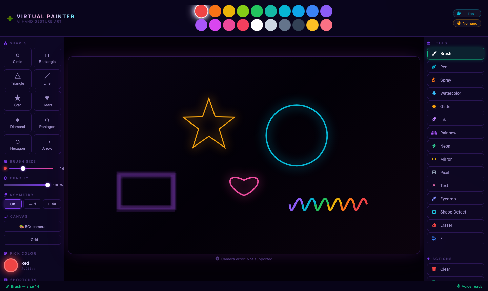
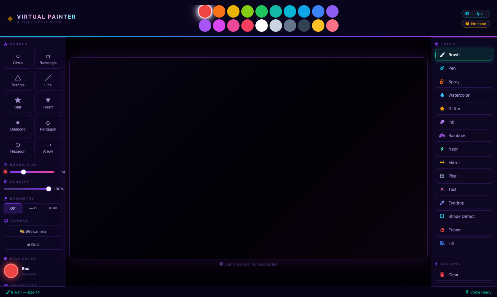
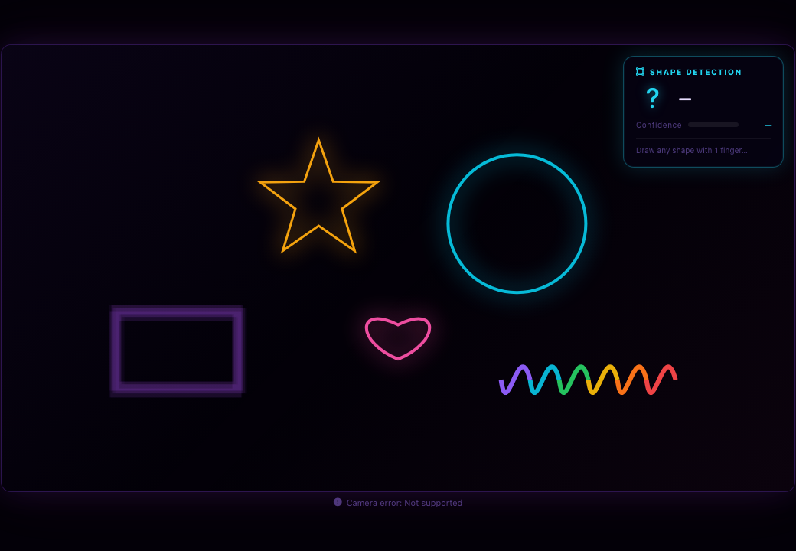
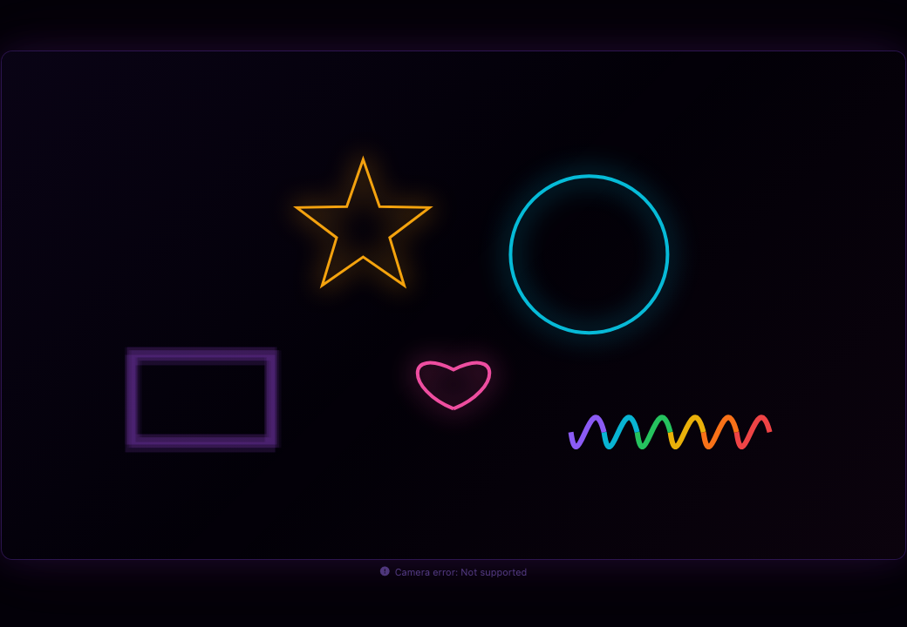
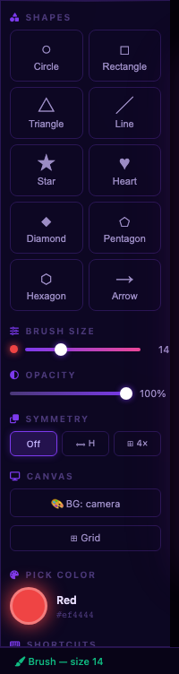
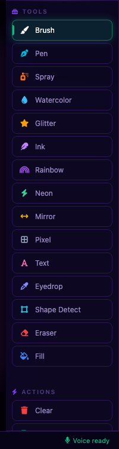

# ✦ Virtual Painter — AI Hand Gesture Drawing

<p align="center">
  
</p>

<p align="center">
  
  
  
  
</p>

---

## The Story

It started with a simple question: *what if you could paint in the air?*

Virtual Painter began as a weekend experiment — a Python script using a webcam and OpenCV to track a single index finger and draw coloured lines on screen. No mouse, no touchscreen, no stylus. Just your hand, a camera, and a canvas that responded to your every movement.

As the project grew, so did its ambitions. We added more tools — spray paint that scattered dots like a real can, a neon glow effect that made lines pulse with electric colour, a mirror mode that reflected every stroke symmetrically. We brought in voice commands so you could shout "red!" to change colour or "undo!" to step back. We added an AI shape detector that watches how you draw and snaps freehand circles and rectangles into clean geometry.

Then came the biggest leap: moving from an OpenCV desktop window to a full **browser-based experience**. The browser version uses MediaPipe's JavaScript library to run hand tracking entirely client-side — no server round-trips, no lag. The UI was rebuilt from scratch with a deep-space dark theme, glassmorphism panels, animated colour swatches, Font Awesome icons, and smooth CSS transitions.

Today Virtual Painter is a creative tool that lives at the intersection of computer vision, human-computer interaction, and digital art. It shows that your hands — the oldest creative tools humanity has ever had — can also be the most futuristic ones.

---

## Screenshots

<table>
  <tr>
    <td width="50%">
      <strong>Full Application</strong><br>
      
    </td>
    <td width="50%">
      <strong>Drawing with Neon &amp; Shape Tools</strong><br>
      
    </td>
  </tr>
  <tr>
    <td width="50%">
      <strong>Shape Detection Panel</strong><br>
      
    </td>
    <td width="50%">
      <strong>Canvas Drawing Area</strong><br>
      
    </td>
  </tr>
  <tr>
    <td width="50%">
      <strong>Left Panel — Shapes &amp; Controls</strong><br>
      
    </td>
    <td width="50%">
      <strong>Right Panel — Tools &amp; Actions</strong><br>
      
    </td>
  </tr>
</table>

---

## Features

### 🎨 Drawing Tools (14 total)
| Tool | Description |
|------|-------------|
| **Brush** | Smooth freehand strokes with adjustable size |
| **Pen** | Thin 1.5px calligraphy line |
| **Spray** | Density-falloff dot scatter (like a real spray can) |
| **Watercolor** | 7-pass jittered translucent wash effect |
| **Glitter** | 4-pointed sparkle burst around the cursor |
| **Ink** | Speed-sensitive width — fast strokes go thin |
| **Rainbow** | Hue auto-cycles through the colour spectrum |
| **Neon** | Additive multi-pass Gaussian glow effect |
| **Mirror** | Simultaneous horizontal-mirror strokes |
| **Pixel** | Snapped square dots for pixel art |
| **Text** | Type text directly onto the canvas |
| **Eyedropper** | Sample any colour from the canvas |
| **Shape Detect** | AI-powered freehand → clean shape snapping |
| **Eraser** | Erase with adjustable size |
| **Fill** | Flood-fill any enclosed region |

### 🔷 Shape Library (10 shapes)
Circle · Rectangle · Triangle · Line · Star · Heart · Diamond · Pentagon · Hexagon · Arrow

### 🤖 AI Shape Detection
Draw any freehand shape and the app detects it in real time:
- **Live preview** — dashed cyan overlay shows the predicted clean shape as you draw
- **Confidence bar** — colour-coded score (green >80%, amber >50%, grey <50%)
- **Auto-snap** — when you lift your finger, the freehand stroke is replaced with the perfect version

### ✦ Creative Controls
- **Opacity slider** — 5%–100%, applies to every tool
- **Symmetry** — Off / Horizontal mirror / 4-way quad with guide lines
- **Background modes** — Camera feed / Black / White / Grid (press `B`)
- **Grid overlay** — reference grid toggle (press `G`)
- **Native colour picker** — click the active colour ring
- **Undo / Redo** — 35-level history

### 🖐 Gesture Controls
| Gesture | Action |
|---------|--------|
| ☝ Index finger up | Draw / use active tool |
| ✌ Index + middle up | Selection mode (hover over palette / buttons) |
| 🤟 Index + middle + ring up | AI shape snap |

---

## Quick Start

### Browser App *(recommended)*
```bash
pip install flask
python app.py
# Opens http://localhost:8080 automatically
# Allow camera access when prompted
```

### Desktop App *(OpenCV window)*
```bash
pip install -r requirements.txt
python main.py          # normal mode
python main.py --demo   # no camera needed
```

---

## Installation

```bash
git clone https://github.com/faizanarshad/AI-Based-Virtual-Painter.git
cd AI-Based-Virtual-Painter

# Browser version only needs Flask
pip install flask

# Desktop version needs full stack
pip install -r requirements.txt   # OpenCV, MediaPipe, SpeechRecognition …
```

**macOS note:** Camera access must be granted to your browser (Settings → Privacy → Camera).

---

## Keyboard Shortcuts

| Key | Action |
|-----|--------|
| `U` | Undo |
| `R` | Redo |
| `S` | Save PNG |
| `C` | Clear canvas |
| `B` | Cycle background |
| `G` | Toggle grid overlay |
| `[` / `]` | Decrease / increase brush size |
| `Esc` | Close text input |

---

## Project Structure

```
AI-Based-Virtual-Painter/
├── app.py                  ← Browser server (Flask, port 8080)
├── main.py                 ← Desktop app entry point
├── static/
│   ├── index.html          ← Single-page UI
│   ├── css/style.css       ← Dark glassmorphism theme
│   └── js/
│       ├── app.js          ← Main app logic + MediaPipe wiring
│       ├── drawing.js      ← All drawing tools (Painter class)
│       ├── gestures.js     ← Finger detection + gesture classification
│       └── shapes.js       ← AI shape detector + confidence scorer
├── src/                    ← Python modules (desktop app)
│   ├── hand_detector.py
│   ├── shape_detector.py
│   ├── voice_controller.py
│   ├── effects.py
│   └── ui_renderer.py
├── output/                 ← Saved paintings land here
├── assets/screenshots/     ← README screenshots
└── requirements.txt
```

---

## Tech Stack

| Layer | Technology |
|-------|-----------|
| Hand tracking | [MediaPipe Hands](https://mediapipe.dev/) (JS + Python) |
| Computer vision | OpenCV (desktop), HTML5 Canvas (browser) |
| AI shape detection | Convex hull + RDP simplification + min-enclosing circle |
| Browser server | Flask |
| UI | HTML5 · CSS3 (glassmorphism) · Font Awesome 6 |
| Voice control | Google Speech API via SpeechRecognition (desktop) |

---

## License

MIT — free to use, modify, and share.

---

<p align="center">
  Made with ✦ by <strong>Faizan Arshad</strong>
</p>
